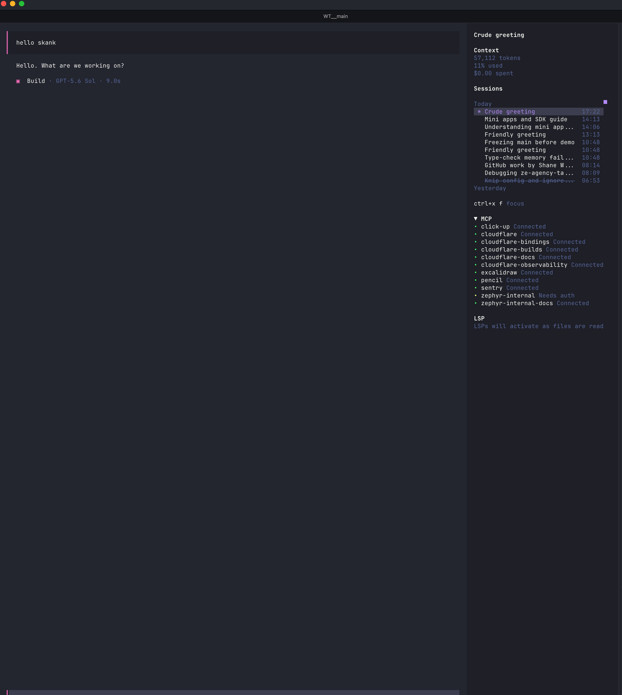

# OpenCode Sidebar Sessions

Browse and switch OpenCode sessions without leaving the sidebar.



## Install

```bash
opencode plugin @swalker326/opencode-sidebar-sessions --global
```

Restart OpenCode after installation.

## Use

| Shortcut | Action |
| --- | --- |
| `<leader>f` | Focus the session list |
| `up` / `down` | Select a session |
| `enter` | Open the selected session |
| `r` | Rename the selected session |
| `a` | Archive the selected session |
| `esc` | Return to the prompt |

## Highlights

- Groups sessions by recent activity day.
- Keeps active sessions first and archived sessions at the bottom of each day.
- Highlights the current session and strikes through archived titles.
- Uses your configured OpenCode leader and navigation keys.
- Updates automatically as sessions change.
